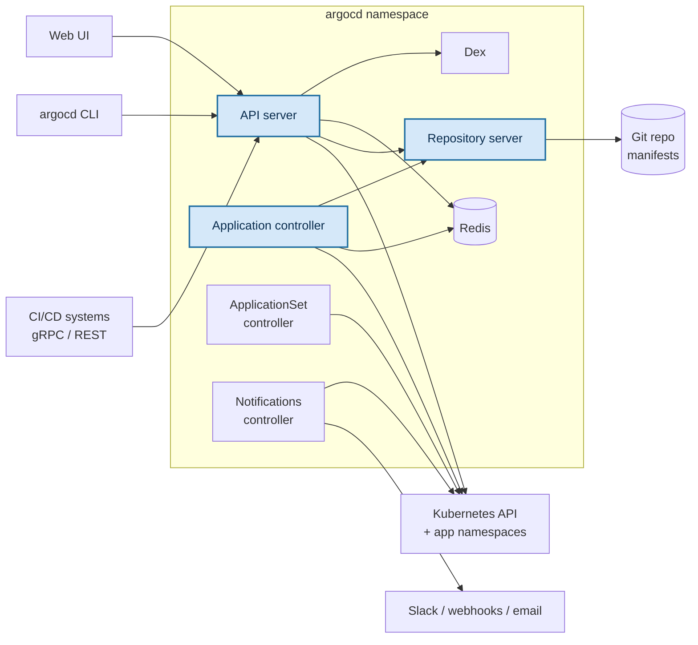

#argocd #kubernetes #gitops #helm

# Argo CD architecture and components

What a `helm install` of the Argo CD chart actually puts in the cluster, and what each piece is for.  
Verified against the running lab install: **Argo CD v3.4.6**, chart **argo-cd-10.2.2**, release `argocd` in namespace `argocd`.

## What gets installed

Seven workloads — six Deployments and one StatefulSet:

| Workload | Kind | Has a Service | Container ports | Role in one line |
|---|---|---|---|---|
| `argocd-server` | Deployment | yes — 80/443 | `server` 8080, `metrics` 8083 | the API server; everything external talks to this |
| `argocd-repo-server` | Deployment | yes — 8081 | `repo-server` 8081, `metrics` 8084 | clones Git, renders manifests |
| `argocd-application-controller` | **StatefulSet** | **no** | `metrics` 8082 only | compares desired vs. live state, applies changes |
| `argocd-redis` | Deployment | yes — 6379 | `redis` 6379 | cache |
| `argocd-dex-server` | Deployment | yes — 5556/5557 | `http` 5556, `grpc` 5557, `metrics` 5558 | identity provider bridge (OIDC/SAML) |
| `argocd-applicationset-controller` | Deployment | yes — 7000 | `metrics` 8080, `probe` 8081, `webhook` 7000 | generates Applications at scale |
| `argocd-notifications-controller` | Deployment | no | `metrics` 9001 | sends alerts on application state changes |

Two things worth pulling out of that table:

- **Seven workloads, not three:** the API server, repository server and application controller do the visible work, but the chart also installs Redis, Dex, an ApplicationSet controller and a notifications controller.
- **The application controller has no Service and exposes only a metrics port:** nothing dials it. It is purely outbound — it reaches out to the repo server, to Redis and to the Kubernetes API, and nothing reaches in. That is the clearest single piece of evidence that it is an internal reconciler rather than a server.

### How the workload names are built

The chart names its resources `argocd-<component>`, and Helm prefixes that with the release name — but the two collapse when the release name already contains `argocd`:

| `helm install <name> argo/argo-cd` | Resulting workloads |
|---|---|
| `argocd` | `argocd-server`, `argocd-repo-server`, … |
| `argo-cd` | `argo-cd-argocd-server`, `argo-cd-argocd-repo-server`, … |

Both forms were observed in this cluster. The upstream docs assume release **`argocd`** in namespace **`argocd`**, which produces the bare names above and lets every copied command run unmodified — worth matching rather than fighting.

## How they fit together



**Note the direction of the repo-server arrows:**  
Both the API server and the application controller *call* the repo server; the repo server never calls them. The controller asks for manifests when it needs to reconcile, and the repo server answers. Nothing is pushed — a repo server that has just refreshed its cache notifies nobody.

## The three core components

### API server — `argocd-server`

> *"The API server is a gRPC/REST server which exposes the API consumed by the Web UI, CLI, and CI/CD systems."*

This is the only externally facing component. Everything we do by hand goes through it: `kubectl port-forward` to the UI, `argocd login` from the CLI, and any programmatic gRPC/REST call from a pipeline.

Its documented responsibilities:

- application management and status reporting
- invoking application operations — sync, rollback, user-defined actions
- repository and cluster credential management, stored as Kubernetes Secrets
- authentication, and auth delegation to external identity providers
- RBAC enforcement
- listener/forwarder for Git webhook events

It holds no state of its own. It translates external requests into work for the other components and returns their answers, which is why it can be scaled to several replicas freely — the docs call it *"stateless and probably the least likely to cause issues."*

### Repository server — `argocd-repo-server`

> *"The repository server is an internal service which maintains a local cache of the Git repository holding the application manifests."*

**Internal** is the operative word: it has a ClusterIP Service on 8081 so the other components can reach it, but it is never exposed outside the cluster.

It generates and returns Kubernetes manifests given:

- repository URL
- revision — commit, tag or branch
- application path
- template-specific settings — Helm values, Kustomize parameters

This is where Helm and Kustomize actually run. The repo server forks and execs those tools, which has two practical consequences worth remembering:

- **It is the memory-hungry component:** concurrent manifest generation is what OOM-kills Argo CD installs; `--parallelismlimit` exists to cap it.
- **It is disk-hungry:** it clones every repository it manages. Manifests are cached for 24 hours by default (`--repo-cache-expiration`), and tool execution is capped at 90 seconds (`ARGOCD_EXEC_TIMEOUT`).

Argo CD never asks us to interact with Git ourselves. Every read of a repository — for a sync, a diff, or a UI preview — passes through here.

### Application controller — `argocd-application-controller`

> *"The application controller is a Kubernetes controller which continuously monitors running applications and compares the current, live state against the desired target state (as specified in the repo)."*

This is the reconciliation engine — the part that makes Argo CD *GitOps* rather than a deployment button.

What it does:

- watches only the resources created through an Argo CD **Application**, not everything in the cluster
- detects the `OutOfSync` state when live and desired differ
- **optionally** takes corrective action — automatic sync and self-healing are opt-in per Application, not the default
- invokes user-defined lifecycle hooks — `PreSync`, `Sync` and `PostSync` are the ones met most often, out of seven phases in all (**15 - Sync and health checks**)

It re-checks Git every two to three minutes by default — a `120s` reconciliation timeout plus up to `60s` of jitter — and maintains a lightweight cache of cluster state using Kubernetes watch APIs rather than repeatedly listing resources.

The word "optionally" is the one to hold on to. Out of the box the controller *reports* drift and does nothing about it. Automated sync, pruning and self-healing are separate switches — the subject of later labs.

## The supporting components

### Redis — `argocd-redis`

A cache, and nothing more. It stores the results of manifest generation and the reported live state of cluster resources, which keeps load off both the Kubernetes API and Git.

> *"Redis is only used as a disposable cache and can be safely rebuilt without service disruption."*

Losing the entire Redis dataset costs performance, not correctness — Argo CD rebuilds it from Git and the Kubernetes API, which are the actual sources of truth. Useful to know before panicking about a crash-looping Redis pod.

### Dex — `argocd-dex-server`

An identity provider bridge supporting **OIDC** and **SAML**. It exists so Argo CD can delegate login to an external system — GitHub, Google, an enterprise LDAP or SAML provider — without implementing each protocol itself.

It is not needed for the built-in `admin` account, which authenticates against a Kubernetes Secret directly. In a lab using only local admin login, Dex sits idle.

### ApplicationSet controller — `argocd-applicationset-controller`

Manages the `ApplicationSet` custom resource, which **templates Applications**. One ApplicationSet plus a generator — a list, a Git directory, a cluster list — produces many Application resources.

This is the answer to managing Argo CD at scale: instead of hand-writing one Application per environment per service, we declare the pattern once. It has a `webhook` port on 7000 so Git providers can notify it directly of changes.

### Notifications controller — `argocd-notifications-controller`

> *"Argo CD Notifications continuously monitors Argo CD applications and provides a flexible way to notify users about important changes in the application state."*

Two moving parts:

| Concept | Answers |
|---|---|
| **Trigger** | *when* to notify — which state change matters |
| **Template** | *what* to say — the content and format of the message |

Applications subscribe to notifications through annotations, and Argo CD ships a catalogue of ready-made triggers and templates (sync succeeded, sync failed, health degraded) so we rarely start from scratch. Destinations are Slack, email, generic webhooks and similar.

Installed by default with the chart. Like the application controller it has no Service — it watches and pushes outward, and nothing dials it.

## Why the application controller is a StatefulSet

Every other component is a Deployment. The controller is the exception, and the reason is **not** that it stores data — the docs are explicit that it is stateless.

It is a StatefulSet because it **shards**. When one controller can't hold the cache for every managed cluster in memory, we scale it out and each replica takes a subset of clusters. Sharding needs each replica to know *which* replica it is, and a StatefulSet is what gives pods a stable ordinal identity — `...-controller-0`, `-1`, `-2` — that survives restarts. A Deployment's pods have random names and no such identity.

Relevant knobs:

- `ARGOCD_CONTROLLER_REPLICAS` — must match the replica count for sharding to divide correctly
- sharding algorithms: `legacy`, `round-robin`, `consistent-hashing`
- `--status-processors` (default 20) and `--operation-processors` (default 10) for throughput within a replica

This lab runs a single replica, so no sharding is in play — but it explains the odd workload kind we see in `kubectl get all`.

## What is actually optional

The clearest way to see which components are load-bearing is **Argo CD Core**, an installation mode that strips Argo CD to *"a fully functional GitOps engine"* and drops everything else.

| Component | In Core? |
|---|---|
| Application controller | yes — the engine |
| Repository server | yes |
| Redis | yes — *"even if the Argo CD controller can run without Redis, it isn't recommended"* |
| CRDs (Application, ApplicationSet) | yes |
| API server | **no** |
| Dex / OIDC authentication | **no** |
| Notifications controller | **no** |
| Argo CD RBAC model | **no** |

In Core mode the Web UI and CLI work only in a limited, local way, and we interact with Argo CD through Kubernetes resources and ordinary Kubernetes RBAC.

The useful takeaway for reading the architecture: **controller + repo server + Redis is Argo CD.** The API server, Dex and the notifications controller exist to give humans and external systems a way in — they are the interface layer, not the engine.

## The CRDs

The chart also installs three custom resource definitions, which is how everything above is configured:

```text
applications.argoproj.io          # one deployed app: source repo + destination cluster/namespace
applicationsets.argoproj.io       # a template that generates many Applications
appprojects.argoproj.io           # a boundary: which repos/clusters/kinds a group of apps may use
```

`Application` is the one that matters immediately — it is the resource that tells the application controller "watch these manifests from this repo, and compare them against this namespace."

## Verify on our own cluster

```bash
kubectl -n argocd get deploy,sts
kubectl -n argocd get svc
kubectl get crd | grep argo
```

Which component is which, with the release prefix stripped:

```bash
kubectl -n argocd get deploy,sts -o custom-columns='KIND:.kind,NAME:.metadata.name,PORTS:.spec.template.spec.containers[*].ports[*].name'
```

Confirm the installed versions rather than assuming the chart's defaults:

```bash
helm -n argocd list                                    # chart version
kubectl -n argocd get deploy argocd-server \
  -o jsonpath='{.spec.template.spec.containers[0].image}'   # Argo CD version
```

> Component names and roles are stable across chart versions; flags and defaults are not. Check the docs for the version we actually have rather than the current stable release.
