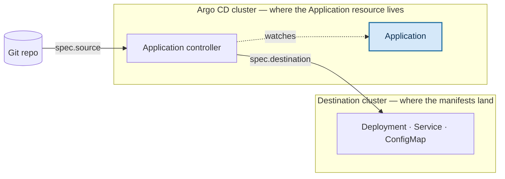

#argocd #kubernetes #gitops #crd #manifests

# The Application CRD

The `Application` is how Argo CD is told what to manage.  
It is a **declarative contract**: a single resource that answers which project owns this app, where its desired state is defined, where the resulting manifests should land, and how aggressively to keep the two in agreement.

Everything else in Argo CD exists to service this object. Schema facts below are read from the CRD installed in the cluster — Argo CD v3.4.6.

## Identity

| | |
|---|---|
| CRD | `applications.argoproj.io` |
| API version | `argoproj.io/v1alpha1` |
| Kind | `Application` |
| Short names | `app`, `apps` — so `kubectl get app` works |
| Scope | **Namespaced** |

Namespaced scope matters more than it looks — see *Where the resource lives* below.

## The minimal manifest

```yaml
apiVersion: argoproj.io/v1alpha1
kind: Application
metadata:
  name: guestbook-prod
  namespace: argocd            # must be a namespace Argo CD watches
spec:
  project: default
  source:
    repoURL: <YOUR_REPO_URL>
    targetRevision: HEAD
    path: guestbook
  destination:
    server: <YOUR_K8S_SERVER>
    namespace: guestbook-prod
```

That is a complete, working Application. No sync policy means **manual sync**: Argo CD will report drift and wait to be told to act.

## The four questions it answers

| Field | Question | Required |
|---|---|---|
| `spec.project` | *Which* Argo CD project owns this app? | **yes** |
| `spec.source` | *Where* is the desired state defined? | one of `source` / `sources` |
| `spec.destination` | *Where* should the manifests be deployed? | **yes** |
| `spec.syncPolicy` | *How* should the deployment be managed? | no |

Read straight off the CRD's own schema:

```bash
kubectl get crd applications.argoproj.io \
  -o jsonpath='{.spec.versions[0].schema.openAPIV3Schema.properties.spec.required}'
```

```text
["destination","project"]
```

**`project` is required, not optional:** omitting it fails validation with `spec.project: Required value`. It is often described as defaulting to `default`, and the reason is that `project: ""` *is* accepted and resolves to the `default` project — but the key itself must be present. Write `project: default` explicitly. The `default` project is created for you at install time.

**`source` is absent from that required list for a specific reason:** an Application may use either a single `source` or a `sources` array for multi-source apps, so the schema cannot demand either one individually.

## Where the resource lives vs. where it deploys

The single most confusable thing about this CRD. They are two different clusters, and usually two different namespaces.

- The **Application resource itself** lives wherever you create it — in the Argo CD cluster, in a namespace Argo CD watches.
- The **manifests from `spec.source`** are deployed to `spec.destination`, which can be an entirely different cluster.



This is what makes the hub-and-spoke topology possible: one Argo CD installation holding hundreds of Application resources, deploying to many separate clusters. For a single-cluster setup the two are the same cluster, addressed as `https://kubernetes.default.svc`.

**Applications are only honoured in namespaces Argo CD watches:** by default that is the Argo CD namespace alone. Creating an Application anywhere else produces no error and no deployment — the object simply sits there ignored. Check what is permitted:

```bash
kubectl -n argocd get cm argocd-cmd-params-cm -o jsonpath='{.data.application\.namespaces}'
```

An empty result means Applications must live in the Argo CD namespace.

## `spec.project`

Projects group Applications and constrain what they may do. The constraint is the point — a project can restrict:

- which source repositories its Applications may pull from
- which destination clusters and namespaces they may deploy to
- which resource kinds they may create

This is the multi-tenancy boundary. One team's project can be scoped so its Applications cannot deploy into another team's namespaces, regardless of who edits the manifest.

The built-in `default` project constrains nothing at all:

```bash
kubectl -n argocd get appproject default \
  -o jsonpath='sourceRepos={.spec.sourceRepos}{"\n"}destinations={.spec.destinations}'
```

```text
sourceRepos=["*"]
destinations=[{"namespace":"*","server":"*"}]
```

Fine for a lab. In a shared cluster it is the thing to replace first.

## `spec.source`

Only `repoURL` is required. Everything else depends on what kind of source it is.

| Field | Meaning |
|---|---|
| `repoURL` | Git or Helm repository URL — **the only required field** |
| `targetRevision` | branch, tag, commit SHA, or Helm chart version. Defaults to `HEAD` |
| `path` | directory within the repository. Git sources only |
| `chart` | chart name — used **instead of** `path` when pulling from a Helm repository |
| `ref` | names this source so other sources can reference it (multi-source) |

The shape changes with the tool. A Git repository of plain YAML needs `path`; a chart pulled straight from a Helm repository needs `chart` and no `path`:

```yaml
# plain manifests in Git
source:
  repoURL: https://github.com/argoproj/argocd-example-apps.git
  targetRevision: HEAD
  path: guestbook
```

```yaml
# a chart from a Helm repository
source:
  repoURL: https://argoproj.github.io/argo-helm
  chart: argo-cd
  targetRevision: 10.2.2
  helm:
    valueFiles:
      - values-prod.yaml
```

Tool-specific blocks nest inside `source` — `helm`, `kustomize`, `directory`, `plugin` — and each carries its own options: `helm.valueFiles`, `helm.values`, `kustomize.images`, `directory.recurse`, and so on. Pinning `targetRevision` to a tag or SHA rather than `HEAD` is what makes a deployment reproducible.

**`sources` (plural) is the multi-source form:** an array of the same structure, useful when a chart lives in one repository and its values in another.

## `spec.destination`

```
destination: { server | name , namespace }
```

Three fields, and the schema marks none of them required, because `server` and `name` are alternatives:

| Field | Meaning |
|---|---|
| `server` | the cluster's API URL. `https://kubernetes.default.svc` means the cluster Argo CD itself runs in |
| `name` | the cluster's registered name in Argo CD — an alternative to `server` |
| `namespace` | target namespace for the deployed resources |

Use one of `server` or `name`, not both.

**`namespace` is a fallback, not an override:** it applies only to namespaced resources whose manifests do not already carry `metadata.namespace`. A manifest with its own namespace set wins, and cluster-scoped resources ignore the field entirely.

The destination namespace is not created for you by default — that needs `CreateNamespace=true` in `syncOptions`.

## `spec.syncPolicy`

Omit it entirely and sync is manual: Argo CD detects drift, marks the app `OutOfSync`, and waits.

```yaml
syncPolicy:
  automated:
    prune: true
    selfHeal: true
  syncOptions:
    - CreateNamespace=true
  retry:
    limit: 5
    backoff:
      duration: 5s
      factor: 2
      maxDuration: 3m
```

**`automated`** turns on continuous reconciliation:

| Field | Effect |
|---|---|
| `prune` | delete resources that were removed from Git. **Off by default** |
| `selfHeal` | revert changes made directly in the cluster. **Off by default** |
| `allowEmpty` | permit a sync that would delete every resource |
| `enabled` | toggle automation without deleting the block |

Both `prune` and `selfHeal` default to off, which surprises people: enabling `automated` alone gets you automatic *application* of new commits, but not deletion of removed resources, and not correction of manual `kubectl edit` changes.

**`syncOptions`** is a list of string flags modifying sync behaviour. The ones worth knowing early:

| Option | Effect |
|---|---|
| `CreateNamespace=true` | create the destination namespace if absent |
| `PruneLast=true` | prune only after everything else has synced |
| `Replace=true` | use `kubectl replace` instead of `apply` |
| `ApplyOutOfSyncOnly=true` | touch only the resources that actually differ |
| `Validate=false` | skip schema validation |

**`retry`** controls what happens after a failed sync: `limit` attempts (`-1` for unlimited) with exponential backoff from `backoff.duration`, multiplied by `backoff.factor`, capped at `backoff.maxDuration`.

## The complete spec

Nine keys are legal directly under `spec:`, and nothing else — every Application is validated against the CRD's schema before it is accepted. Five have their own sections above:

`project` · `source` · `sources` · `destination` · `syncPolicy`

The other four:

| Field | Purpose |
|---|---|
| `ignoreDifferences` | exclude specific fields from the diff, by JSON pointer, JQ expression or managing field manager. The cure for perpetual `OutOfSync` caused by mutating webhooks or autoscalers |
| `info` | arbitrary key/value pairs surfaced in the UI — links to dashboards, runbooks, owners |
| `revisionHistoryLimit` | how many past revisions to keep for rollback. Defaults to `10`; `0` disables history |
| `sourceHydrator` | renders manifests into a separate branch, so Git holds the final YAML rather than the templates |

The set grows between releases — `sourceHydrator` is a recent addition — so read it from the cluster rather than from documentation written for a different version:

```bash
kubectl explain application.spec
```

That prints every field with its type, its description, and a `-required-` marker where one applies.

## Creating one

Three routes, producing the same object:

```bash
# CLI
argocd app create guestbook-prod \
  --repo https://github.com/argoproj/argocd-example-apps.git \
  --path guestbook \
  --dest-server https://kubernetes.default.svc \
  --dest-namespace guestbook-prod
```

```bash
# manifest
kubectl apply -f application.yaml
```

...and the web UI's **New App** form, which asks for exactly the fields above.

The manifest is the one to prefer. It is the only route where the definition is itself version-controlled, reviewable and reappliable to a rebuilt cluster — which is the whole premise of running Argo CD. The UI and CLI are convenient for exploration, and both are describing the same YAML underneath. Reading an existing app is the fastest way to see what a form produced:

```bash
kubectl -n argocd get app guestbook-prod -o yaml
```

## Verify

```bash
kubectl -n argocd get app                      # short name works
kubectl -n argocd get app <name> -o yaml       # full spec and live status
kubectl explain application.spec                # field docs from the cluster
kubectl explain application.spec.syncPolicy.automated
argocd app get <name>                           # Argo CD's own view, incl. sync/health
```

`kubectl explain` reads the schema actually installed, so it is always correct for the version you are running — unlike documentation for the current release.
