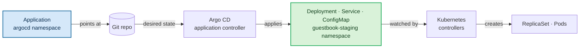

#argocd #kubernetes #gitops #crd #manifests

# Argo CD Applications vs. Kubernetes primitive manifests

The word *application* does two jobs here, and they are not the same thing:

- the **`Application`** resource — an Argo CD object that says where our manifests live and how to sync them
- **our application** — the Deployments, Services and ConfigMaps that actually run our code

They are both Kubernetes resources in the same cluster, which is exactly why they get confused. The distinction is worth nailing down once.

## What they have in common

Both are ordinary objects in the Kubernetes API. Neither is special infrastructure — both are stored in etcd, both are namespaced, both answer to `kubectl`:

```bash
kubectl api-resources --namespaced=true
```

```text
NAME           SHORTNAMES   APIVERSION             NAMESPACED   KIND
configmaps     cm           v1                     true         ConfigMap
services       svc          v1                     true         Service
deployments    deploy       apps/v1                true         Deployment
applications   app,apps     argoproj.io/v1alpha1   true         Application
```

The only structural difference visible here is the API group: `Deployment` comes from `apps/v1`, built into every cluster, while `Application` comes from `argoproj.io/v1alpha1`, which exists only because Argo CD installed a CRD for it.

## The comparison

| | `Application` | Workload manifests |
|---|---|---|
| **Kind** | `Application` | `Deployment`, `Service`, `ConfigMap`, `Ingress`, … |
| **Purpose** | a declarative **contract** for Argo CD to manage a set of manifests | the **definition** of the components that make up our running app |
| **Answers** | *Where* is the code? *Where* should it be deployed? *How* should it be synced? | *Which* image to run? *Which* ports to open? *How many* replicas? |
| **Lives in** | the Argo CD namespace — `argocd` by convention | the target namespace — `guestbook-staging`, `guestbook-prod`, … |
| **Reconciled by** | the Argo CD controllers | the Kubernetes controllers — Deployment controller, ReplicaSet controller, … |
| **Understood by a bare cluster** | no — needs Argo CD installed | yes — built in |

The last row is the one that explains all the others. A cluster without Argo CD will happily accept a `Deployment` and run it. Hand it an `Application` and it will reject the manifest outright: no CRD, no such kind.

## Side by side

The `Application` — a pointer, roughly 15 lines regardless of how big the app is:

```yaml
apiVersion: argoproj.io/v1alpha1
kind: Application
metadata:
  name: guestbook-staging
  namespace: argocd
spec:
  project: default
  source:
    repoURL: https://github.com/argoproj/argocd-example-apps.git
    targetRevision: HEAD
    path: guestbook
  destination:
    server: https://kubernetes.default.svc
    namespace: guestbook-staging
```

One of the manifests it manages, living in the Git repo at `guestbook/`:

```yaml
apiVersion: apps/v1
kind: Deployment
metadata:
  name: guestbook-ui
spec:
  replicas: 2
  template:
    spec:
      containers:
        - name: guestbook-ui
          image: gcr.io/heptio-images/ks-guestbook-demo:0.2
          ports:
            - containerPort: 80
```

## The Application holds no workload detail

Read the two together and the division is obvious: **there is no image, no replica count, no port anywhere in the `Application`.** It never describes what runs. It describes where to find the description.

That indirection is the whole design:

- **Editing the `Application` never changes what runs**, only where Argo CD looks for it. Repoint `targetRevision` from `HEAD` to a tag and we have changed which commit is deployed — but we did so by changing a pointer, not a workload.
- **Editing the manifests in Git changes what runs**, without touching the `Application` at all. Bump `replicas` to 5, commit, and the next sync applies it.
- **The `Application` stays the same size as the app grows** — fifteen lines whether the path holds one manifest or two hundred.

This is what people mean by Argo CD being declarative about *deployment* rather than about *workloads*. Kubernetes was already declarative about workloads.

## Who reconciles what

Two reconciliation loops, chained, each owning its own layer:



Argo CD's job ends the moment the manifests are applied. It does not create Pods — it creates a `Deployment`, and the Deployment controller creates a ReplicaSet, which creates Pods. Argo CD then *watches* the result to report health, but the mechanics belong to Kubernetes.

**The managed set may itself contain custom resources:** a `Certificate`, a `Rollout`, a `Prometheus`.  
That is fine — Argo CD applies them like anything else. But applying a resource is not the same as running it, so whichever controller understands that CRD must also be installed, or the object will sit in the cluster doing nothing. Argo CD will happily report it as synced and healthy-looking while nothing acts on it.

## How Argo CD knows which resources are its

The `Application` names a repository and a path. It does not list what it will create — that list only exists once the manifests are rendered. So given a `Deployment` sitting in the cluster, how does Argo CD decide whether it belongs to `guestbook`, to another app, or to nothing at all?

It stamps everything it applies with a tracking identifier.

```bash
kubectl -n default get deploy guestbook-ui \
  -o jsonpath='{.metadata.annotations.argocd\.argoproj\.io/tracking-id}'
```

```text
guestbook:apps/Deployment:default/guestbook-ui
```

The format identifies both the owning application and the exact object:

```text
guestbook : apps/Deployment : default/guestbook-ui
└───┬────┘   └──────┬──────┘   └────────┬────────┘
    │               │                   │
    │               │                   └─ namespace/name
    │               └─ API group and kind
    └─ the Application that owns it
```

Core-group resources leave the group segment empty, which is why the Service reads:

```text
guestbook:/Service:default/guestbook-ui
```

### Three tracking methods

| Method | What it uses |
|---|---|
| `annotation` **(default)** | the `argocd.argoproj.io/tracking-id` annotation |
| `annotation+label` | the annotation for tracking, plus `app.kubernetes.io/instance` for other tools to read |
| `label` | the `app.kubernetes.io/instance` label alone |

Set install-wide, not per application:

```yaml
# argocd-cm
data:
  application.resourceTrackingMethod: annotation
```

**The label key is configurable as well**, so `app.kubernetes.io/instance` is only the fallback: *"If omitted, Argo CD injects the app name into the label: `app.kubernetes.io/instance`"*. Under `label` tracking Argo CD *"Uses the `application.instanceLabelKey` label for tracking"* — whatever that key has been set to:

```yaml
# argocd-cm
data:
  application.instanceLabelKey: argocd.argoproj.io/instance
```

That override ships in the official install manifests, so on a stock install `app.kubernetes.io/instance` is not the label in use even if we switch tracking to `label`.

**Label tracking is the legacy option, and the docs are direct about why:**

- **labels are truncated to 63 characters**, so long application names collide silently
- *"Other external tools might write/append to this label and create conflicts with Argo CD"*
- with two Argo CD instances on one cluster, a bare label cannot say which instance owns what

**Changing the method requires a re-sync:** *"Note that once you change the value you need to sync your applications again (or wait for the sync mechanism to kick-in) in order to apply your changes."* Existing resources keep their old marking until something re-applies them.

### Why the id names the object, not just the app

Kubernetes copies a Deployment's annotations onto the ReplicaSets it creates. So the ReplicaSet nobody wrote a manifest for carries a tracking id too:

```text
deployment.apps/guestbook-ui              guestbook:apps/Deployment:default/guestbook-ui
replicaset.apps/guestbook-ui-6595f948db   guestbook:apps/Deployment:default/guestbook-ui
pod/guestbook-ui-6595f948db-hdqrv         <none>
```

Look at what the ReplicaSet's copy actually says: `apps/Deployment:default/guestbook-ui`. It names the **Deployment**, not the ReplicaSet. The annotation travelled, but it did not change meaning, so Argo CD can see it does not refer to the object carrying it and ignores it.

A bare `app.kubernetes.io/instance: guestbook` label would have been copied the same way and would have been indistinguishable from a real one — the ReplicaSet would look tracked. Encoding group, kind, namespace and name is what makes an inherited annotation harmless.

Pods carry nothing at all, because the annotation sits on the Deployment's own metadata rather than its pod template.

### What tracking buys

Three behaviours depend on it:

- **Pruning** — a resource carrying this app's id but absent from the rendered manifests is one Argo CD created and Git no longer wants
- **Cascading delete** — deleting the `Application` can find its resources without keeping a stored inventory
- **Leaving strangers alone** — an object with no tracking id, or one belonging to another application, is not this app's to manage

## Deleting them is not symmetric

Deleting a `Deployment` is unambiguous — the workload goes away, and if `selfHeal` is on, Argo CD puts it back.

Deleting an `Application` has two possible outcomes, and which we get depends on a finalizer:

| | Behaviour |
|---|---|
| **Cascading** — `resources-finalizer.argocd.argoproj.io` present | deletes the `Application` *and* every resource it manages |
| **Non-cascading** — no finalizer | deletes only the `Application`; Deployments, Services and ConfigMaps are **preserved and keep running**, now unmanaged |

```yaml
metadata:
  name: guestbook-staging
  finalizers:
    - resources-finalizer.argocd.argoproj.io    # opt in to cascading delete
```

Non-cascading is the deliberate way to stop managing something with Argo CD while leaving it running.  
Cascading has two propagation modes: **foreground** (the default — the `Application` is removed only after its resources are gone) and **background** (the `Application` disappears immediately and cleanup continues behind it).

Worth internalising before the first `kubectl delete app`: without the finalizer we get an orphaned workload with nothing reconciling it, and with it we may delete a production namespace's contents in one command.

## Talking about them precisely

The overloading is a real source of confusion in conversation and in commit messages. Two habits that help:

- say **"the Application resource"** or **"the Argo CD app"** for the CRD, and **"the workload manifests"** or **"the app's manifests"** for the rest
- watch the shortnames — `kubectl get apps` returns **Argo CD Applications**, not anything to do with our workloads. `app` and `apps` both belong to `argoproj.io`

## Verify

```bash
kubectl -n argocd get applications                 # the contracts
kubectl -n guestbook-staging get deploy,svc,cm     # what those contracts produced

kubectl -n argocd get app guestbook-staging -o yaml   # no image, no replicas — a pointer
kubectl api-resources | grep -E 'applications|deployments'
```

The clearest single check is the third: read an `Application` in full and confirm that nothing in it describes a running process.
