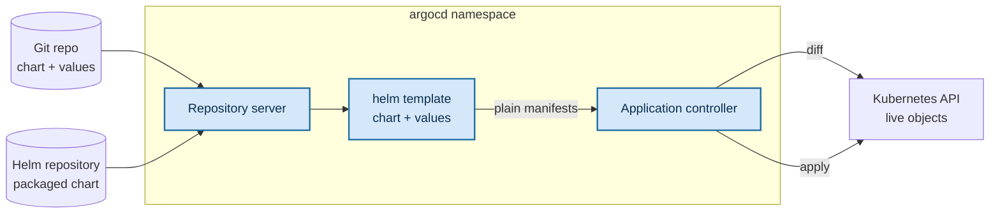

#argocd #helm #gitops #templating

# Managing Helm charts with Argo CD

A Helm chart can be the source of an `Application` exactly as a directory of plain manifests can.  
What changes is less than we would expect, because Argo CD does not become a Helm client when we point it at a chart — it borrows Helm's templating and nothing else.

That single fact explains nearly every surprise in this area.

## Argo CD is a Helm template engine

When an `Application` sources a chart, Argo CD never runs `helm install` or `helm upgrade`. It renders the chart and applies the result:

> *"When deploying a Helm application Argo CD is using Helm only as a template mechanism. It runs `helm template` and then deploys the resulting manifests on the cluster instead of doing `helm install`."*

The Helm user guide splits the responsibilities in one line: *"Helm is only used to inflate charts with `helm template`"*, and *"The lifecycle of the application is handled by Argo CD instead of Helm."*

**This is a deliberate design choice, not a gap:** *"This decision was made so that Argo CD is neutral to all manifest generators."* Helm, Kustomize, jsonnet and plain directories all reduce to the same thing — a stream of rendered Kubernetes manifests — so everything downstream of the render needs to understand only Kubernetes objects.

## Helm lifecycle operations and their Argo CD equivalents

Helm records every `install` and `upgrade` as a **release**: a Secret in the release's namespace holding the rendered manifests, the chart metadata and a revision number. `helm template` writes no such record — it prints YAML and stops. Every Helm command that works by reading a release therefore has nothing to read:

| Absent | Why | What replaces it |
|---|---|---|
| `helm list` | nothing was installed, so there is no release to list | `argocd app list`, `kubectl -n argocd get app` |
| `helm history` | revision history lives in the release record | `argocd app history` — over Git revisions |
| `helm rollback` | rollback replays a stored release revision | `argocd app rollback` |
| `helm upgrade` | changes arrive as a re-render plus an apply | a Git commit, then a sync |
| `helm uninstall` | uninstall deletes the objects a release tracks | deleting the `Application`, with the cascading finalizer |
| `sh.helm.release.v1.*` Secrets | written by install and upgrade, never by template | the `Application` and its tracking annotation |

The FAQ states the consequence plainly: *"This means that you cannot use any Helm command to view/verify the application. It is fully managed by Argo CD."*

It also points out that the trade is not one-sided: *"Note that Argo CD supports natively some capabilities that you might miss in Helm (such as the history and rollback commands)."* Those operate on the `Application` against Git revisions rather than on Helm's release ledger, but the capability is there.

## The render pipeline



Step by step:

1. the **repository server** fetches the chart — cloning a Git repository, or pulling a packaged chart from a Helm repository
2. it resolves the chart's dependencies, which is why an isolated install may need internal Helm repositories configured: *"Even if the chart uses only dependencies from internal repos Helm might decide to refresh `stable` repo"*
3. it assembles the values from every configured source and runs `helm template`
4. the output — plain manifests, with no Helm construct left in them — becomes the desired state handed to the **application controller**
5. the controller diffs that against the live cluster and applies what differs

Helm appears at step 3 and nowhere else. Nothing after it knows the manifests came from a chart.

## What actually gets compared

Not the chart. Not the templates. Not `values.yaml`. The **rendered manifests**.

That cuts both ways:

- editing a template changes the desired state only if the render changes — a comment or whitespace edit produces no diff at all
- a chart whose render is identical to a directory of plain manifests is, to Argo CD, the very same desired state

The second point pays off in practice: we can migrate off Helm without Argo CD noticing. We run `helm template` ourselves, commit the output as plain manifests, repoint `spec.source` at that directory, and the comparison lands on exactly the objects it was already comparing. The application stays `Synced` across a change of templating engine, because the engine was never what was being compared.

## Where the chart comes from

Two shapes, distinguished by whether we set `path` or `chart`:

| Source | Key | What `targetRevision` means |
|---|---|---|
| A chart inside a Git repository | `path` — the directory holding `Chart.yaml` | a Git ref: branch, tag or commit |
| A chart in a Helm repository | `chart` — the chart name | a chart version |

A chart committed to our own repository:

```yaml
spec:
  source:
    repoURL: https://github.com/maor-klir/argocd-example-apps.git
    targetRevision: HEAD
    path: helm-guestbook
    helm:
      valueFiles:
        - values.yaml
```

A chart pulled from a public Helm repository:

```yaml
spec:
  source:
    chart: sealed-secrets
    repoURL: https://bitnami-labs.github.io/sealed-secrets
    targetRevision: 1.16.1
    helm:
      releaseName: sealed-secrets
  destination:
    server: "https://kubernetes.default.svc"
    namespace: kubeseal
```

**The shift in `targetRevision` is the thing to notice:** with `path` it is a Git ref and `HEAD` is meaningful; with `chart` it is a chart version, and pinning it is the only way to get a reproducible render.

## Values

Values can be supplied five ways, and the order they resolve in is documented exactly:

> *"Order of precedence is `parameters > valuesObject > values > valueFiles > helm repository values.yaml`."*

Read it right to left: the chart's own `values.yaml` is the weakest, and `parameters` overrides everything.

| Key | Shape | `helm template` equivalent |
|---|---|---|
| `valueFiles` | list of paths inside the repository | `--values` |
| `values` | a YAML document embedded as a string | — |
| `valuesObject` | the same content embedded as real YAML | — |
| `parameters` | `name` / `value` pairs | `--set` |
| `fileParameters` | `name` / `path` pairs, value read from the file | `--set-file` |

`valuesObject` is preferable to `values` where we have the choice — it is structured YAML that editors and schema validation can see, rather than an opaque block of text.

Within `valueFiles` later entries win, *"the last file listed has the highest precedence"*, and for duplicate keys inside one file *"the last one wins"*.

**Value paths stay inside the repository:** *"Glob patterns cannot match files outside the repository root, even with patterns like `../../secrets/*.yaml`."* Pulling values from a different repository requires multiple sources, where a `ref` names the other source and is then referenced as a variable:

```yaml
spec:
  sources:
    - repoURL: https://git.example.com/my-configs.git
      ref: configs
    - repoURL: https://git.example.com/my-chart.git
      path: chart
      helm:
        valueFiles:
          - $configs/envs/*.yaml
```

## The release name

Charts routinely template `.Release.Name` into object names and labels, so the render depends on what it is set to:

> *"By default, the Helm release name is equal to the Application name to which it belongs."*

`helm.releaseName` overrides it when the chart's naming has to differ from the `Application` name. The docs flag a cost, though: Argo CD *"injects this label with the value of the Application name for tracking purposes"* — meaning `app.kubernetes.io/instance` — so a chart that templates that same label from the release name can end up contending with the tracking label. It is one of the reasons the annotation method is the default rather than the label one: **13 - Argo CD Applications vs. Kubernetes primitive manifests**.

## Helm hooks become sync hooks

Hooks survive the translation, because Argo CD rewrites them into its own:

> *"Argo CD supports many (most?) Helm hooks by mapping the Helm annotations onto Argo CD's own hook annotations."*

| Helm annotation | Argo CD equivalent |
|---|---|
| `helm.sh/hook: pre-install` | `argocd.argoproj.io/hook: PreSync` |
| `helm.sh/hook-weight` | `argocd.argoproj.io/sync-wave` |

A chart's pre-install Job therefore runs in the `PreSync` phase of a sync, ordered by wave — the same phase and wave machinery every other sync uses, covered in **15 - Sync and health checks**. The chart's intent is preserved; the thing executing it is Argo CD.

## CRDs and tests

Two render behaviours charts commonly trip over:

| Key | Effect |
|---|---|
| `skipCrds: true` | leaves the chart's `crds/` directory out of the render |
| `skipTests: true` | leaves test manifests out of the render |

CRDs are included by default — *"Helm installs custom resource definitions in the `crds` folder by default if they are not existing"* — so Argo CD renders them, applies them, and from then on manages them like any other resource it owns.

## Which Helm binary renders

The chart is rendered by the Helm binary inside the repository server, never by anything on our machine. The version that matters is the one that image ships:

```bash
kubectl -n argocd exec deploy/argocd-repo-server -- helm version
```

| Argo CD | Helm in the repo-server |
|---|---|
| `v3.4.6` | `v3.19.4` |

The `helm.version` field in the spec is a leftover — it *"exists for backwards-compatibility only"*, because *"the only Helm binary used to render charts in Argo CD (starting with version 3.5) is v4"*.

## Verify

The sharpest check is that no Helm release exists for a chart Argo CD manages:

```bash
helm list -A                                 # a chart-sourced app does not appear
kubectl get secret -A -l owner=helm          # no sh.helm.release.v1.<app> for it

argocd app manifests guestbook               # the rendered output, post-template
kubectl -n argocd get app guestbook \
  -o jsonpath='{.spec.source}'               # path or chart, plus the helm block
```

On this cluster the only release secret is `sh.helm.release.v1.argocd.v1` in `argocd` — Argo CD's own installation, which genuinely was installed with Helm. Nothing Argo CD deploys will ever add to that list.
